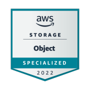

# Hola 👋, I'm Azhar
<!--
**azhar22k/azhar22k** is a ✨ _special_ ✨ repository because its `README.md` (this file) appears on your GitHub profile.

I'm a polyglot, ambivert, and love Sci-Fi.

Here are some ideas to get you started:
- 🔭 Currently working on **AWS**, **Terraform**, **Kubernetes**, and **Superset**
- 💬 Ask me about Cloud Architecture, Infrastructure as Code, and DevOps

- 🔭 I’m currently working on AWS, Terraform
- 🌱 I’m currently learning ...
- 👯 I’m looking to collaborate on ...
- 🤔 I’m looking for help with ...
- 💬 Ask me about ...
- 📫 How to reach me: ...
- 😄 Pronouns: ...
- ⚡ Fun fact: ...
-->
---

### 🌐 Connect with me

  &nbsp;&nbsp;
  &nbsp;&nbsp;
  &nbsp;&nbsp;
  &nbsp;&nbsp;
  &nbsp;&nbsp;
  &nbsp;&nbsp;
  

I'm a polyglot, ambivert and loves Sci-Fi
---

- 💬 Ask me about AWS, Terraform, Kubernetes, Superset

### 🏆 Certifications & Badges

  
  
  
  
  
  

---

### 📊 GitHub Overview & Top Languages

<picture>
  <source media="(prefers-color-scheme: dark)" srcset="./assets/stats-dark.svg" />
  <source media="(prefers-color-scheme: light)" srcset="./assets/stats-light.svg" />
  
</picture>

---

### 🐍 Contribution Graph

<picture>
  <source media="(prefers-color-scheme: dark)" srcset="./assets/snake-dark.svg" />
  <source media="(prefers-color-scheme: light)" srcset="./assets/snake-light.svg" />
  
</picture>

---

### ⚡ Recent Activity

<!-- START_SECTION:activity -->
- 🌱 created branch `feat/async-spawn-cli-enhancements` in [azhar22k/ourl](https://github.com/azhar22k/ourl) `(Sep 14)`
- 🚀 pushed 0 commits to [azhar22k/ourl](https://github.com/azhar22k/ourl) `(Sep 14)`
- 🔀 merged PR [#25 in azhar22k/ourl](https://github.com/azhar22k/ourl) `(Sep 14)`
- 🔀 opened PR [#25 in azhar22k/ourl](https://github.com/azhar22k/ourl) `(Sep 14)`
- 🔀 merged PR [#23 in azhar22k/ourl](https://github.com/azhar22k/ourl) `(Sep 14)`
- 🔀 opened PR [#23 in azhar22k/ourl](https://github.com/azhar22k/ourl) `(Sep 14)`
<!-- END_SECTION:activity -->
