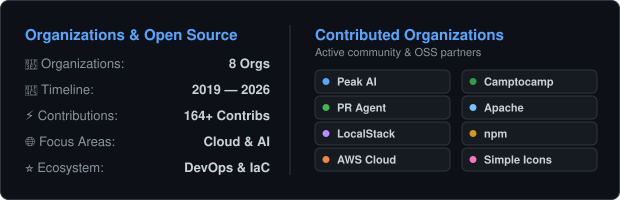

<picture>
  <source media="(prefers-color-scheme: dark)" srcset="./assets/dr-strange-spine-dark.svg" />
  <source media="(prefers-color-scheme: light)" srcset="./assets/dr-strange-spine-light.svg" />
  
</picture>

# Hola 👋, I'm Azhar

### 🌐 Connect with me

  &nbsp;&nbsp;
  &nbsp;&nbsp;
  &nbsp;&nbsp;
  &nbsp;&nbsp;
  &nbsp;&nbsp;
  &nbsp;&nbsp;
  

---
I'm a polyglot, ambivert and loves Sci-Fi

- 💬 Ask me about AWS, Terraform, Kubernetes, Superset, B2C, Retail AI, Merchandising
---

### 🏆 Certifications & Badges

  
  
  
  
  
  

 

---

### 📊 GitHub Overview & Top Languages
<picture>
  <source media="(prefers-color-scheme: dark)" srcset="./assets/stats-dark.svg" />
  <source media="(prefers-color-scheme: light)" srcset="./assets/stats-light.svg" />
  
</picture>

---
### 🏢 Organizations Contributed To

<!-- START_SECTION:organizations -->
<picture>
  <source media="(prefers-color-scheme: dark)" srcset="./assets/orgs-dark.svg" />
  <source media="(prefers-color-scheme: light)" srcset="./assets/orgs-light.svg" />
  
</picture>

<table width="100%" align="left">
  <tr>
    <td align="center" width="25%" valign="top">
      <a href="https://github.com/peak-ai" target="_blank">
         
        <b>Peak AI</b>
      </a>
       
      <code>📅 2019 — 2026</code>
       
      <i>Enterprise AI & Cloud Infrastructure</i>
       
      <a href="https://github.com/peak-ai/eks-token" target="_blank"><code>eks-token</code></a> • <a href="https://github.com/peak-ai/terraform-modules" target="_blank"><code>terraform-modules</code></a> • <a href="https://github.com/peak-ai/ais-service-discovery-python" target="_blank"><code>ais-service-discovery-python</code></a> (+6)
    </td>
    <td align="center" width="25%" valign="top">
      <a href="https://github.com/The-PR-Agent" target="_blank">
         
        <b>The PR Agent</b>
      </a>
       
      <code>📅 2026</code>
       
      <i>AI-Powered Automated PR Code Reviews</i>
       
      <a href="https://github.com/The-PR-Agent/pr-agent" target="_blank"><code>pr-agent</code></a>
    </td>
    <td align="center" width="25%" valign="top">
      <a href="https://github.com/localstack" target="_blank">
         
        <b>LocalStack</b>
      </a>
       
      <code>📅 2026</code>
       
      <i>Local AWS Cloud Development Platform</i>
       
      <a href="https://github.com/localstack/rolo" target="_blank"><code>rolo</code></a> • <a href="https://github.com/localstack/pulumi-local" target="_blank"><code>pulumi-local</code></a>
    </td>
    <td align="center" width="25%" valign="top">
      <a href="https://github.com/peak-platform" target="_blank">
         
        <b>Peak Platform</b>
      </a>
       
      <code>📅 2020, 2022</code>
       
      <i>Open Source Ecosystem</i>
       
      <a href="https://github.com/peak-platform/.github" target="_blank"><code>.github</code></a> • <a href="https://github.com/peak-platform/kafka-connect-jdbc" target="_blank"><code>kafka-connect-jdbc</code></a>
    </td>
  </tr>
  <tr>
    <td align="center" width="25%" valign="top">
      <a href="https://github.com/aws-cloudformation" target="_blank">
         
        <b>AWS CloudFormation</b>
      </a>
       
      <code>📅 2022</code>
       
      <i>AWS Infrastructure as Code (IaC)</i>
       
      <a href="https://github.com/aws-cloudformation/cloudformation-coverage-roadmap" target="_blank"><code>cloudformation-coverage-roadmap</code></a>
    </td>
    <td align="center" width="25%" valign="top">
      <a href="https://github.com/camptocamp" target="_blank">
         
        <b>Camptocamp</b>
      </a>
       
      <code>📅 2020 — 2021</code>
       
      <i>Open Source DevOps & Terraform State</i>
       
      <a href="https://github.com/camptocamp/terraboard" target="_blank"><code>terraboard</code></a>
    </td>
    <td align="center" width="25%" valign="top">
      <a href="https://github.com/PeakBI" target="_blank">
         
        <b>Peak</b>
      </a>
       
      <code>📅 2021</code>
       
      <i>All things peak related!</i>
       
      <a href="https://github.com/PeakBI/aws.signature" target="_blank"><code>aws.signature</code></a>
    </td>
    <td align="center" width="25%" valign="top">
      <a href="https://github.com/apache" target="_blank">
         
        <b>The Apache Software Foundation</b>
      </a>
       
      <code>📅 2020</code>
       
      <i>Open-Source Data Exploration (Superset)</i>
       
      <a href="https://github.com/apache/superset" target="_blank"><code>superset</code></a>
    </td>
  </tr>
  <tr>
    <td align="center" width="25%" valign="top">
      <a href="https://github.com/npm" target="_blank">
         
        <b>npm</b>
      </a>
       
      <code>📅 2020</code>
       
      <i>JavaScript Package Manager Ecosystem</i>
       
      <a href="https://github.com/npm/npm-expansions" target="_blank"><code>npm-expansions</code></a>
    </td>
    <td align="center" width="25%" valign="top">
      <a href="https://github.com/simple-icons" target="_blank">
         
        <b>Simple Icons</b>
      </a>
       
      <code>📅 2020</code>
       
      <i>Developer Tech & Brand SVG Icons</i>
       
      <a href="https://github.com/simple-icons/simple-icons" target="_blank"><code>simple-icons</code></a>
    </td>
  </tr>
</table>

<!-- END_SECTION:organizations -->

---

### 🐍 Contribution Graph

<picture>
  <source media="(prefers-color-scheme: dark)" srcset="./assets/snake-dark.svg" />
  <source media="(prefers-color-scheme: light)" srcset="./assets/snake-light.svg" />
  
</picture>

---

### ⚡ Recent Activity

<!-- START_SECTION:activity -->
- 🚀 pushed 0 commits to [azhar22k/azhar22k](https://github.com/azhar22k/azhar22k) `(Sep 26)`
- 🔀 opened PR [#40 in localstack/pulumi-local](https://github.com/localstack/pulumi-local) `(Sep 26)`
- 🌱 created branch `fix-pulumi-missing-infinite-loop` in [azhar22k/pulumi-local](https://github.com/azhar22k/pulumi-local) `(Sep 26)`
- 🍴 forked [localstack/pulumi-local](https://github.com/localstack/pulumi-local) `(Sep 26)`
- 🔀 opened PR [#45 in localstack/rolo](https://github.com/localstack/rolo) `(Sep 26)`
- 🌱 created branch `fix-restore-payload-methods` in [azhar22k/rolo](https://github.com/azhar22k/rolo) `(Sep 26)`
<!-- END_SECTION:activity -->

 

